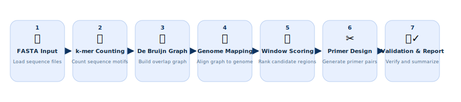
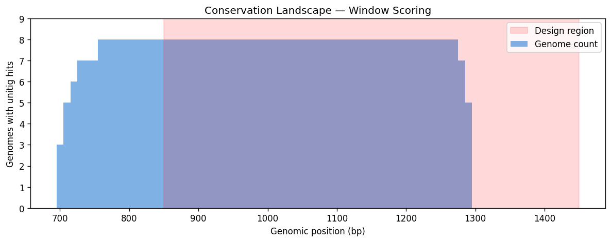
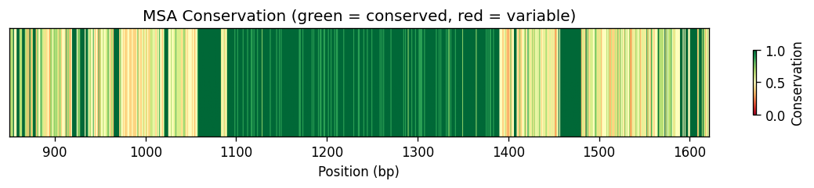

# skipalign

[](https://github.com/Key-man-fromArchive/skipalign/actions/workflows/ci.yml)
[](https://www.python.org/downloads/)
[](LICENSE)

Alignment-free conserved region discovery for RT-qPCR primer-probe design in highly divergent viral genera.

Based on the alignment-free k-mer guided approach from [Sayasit et al. (2026)](https://doi.org/10.64898/2026.03.17.712358).

## Why skipalign?

Designing pan-genus RT-qPCR assays for highly variable viruses (>25-30% divergence) requires finding **where to target** — and that's the hard part. Traditional MSA fails at this divergence level, producing unreliable alignments with false conservation signals.

**skipalign** solves the discovery problem: it finds genuinely conserved regions *without* alignment using k-mer analysis and compacted De Bruijn graphs. It then extracts template sequences with per-position conservation scores, giving you the ideal starting point for primer-probe design in your tool of choice (Geneious, IDT PrimerQuest, Primer-BLAST, etc.).

> **Note**: skipalign focuses on **conserved region discovery and template extraction**. It provides candidate primer suggestions via primer3 as a convenience, but final primer-probe optimization should be done in specialized design tools with manual review.

## Pipeline



The pipeline discovers conserved regions without global alignment, then designs TaqMan primer-probe sets with in-silico validation:

1. **k-mer Counting** — Decompose genomes into canonical 19-mers
2. **De Bruijn Graph** — Merge overlapping conserved k-mers into unitigs
3. **Genome Mapping** — Map unitigs back to genomic coordinates
4. **Window Scoring** — Score 300bp windows by conservation across genomes
5. **Template Extraction** — MAFFT local MSA + per-position conservation scores
6. **Candidate Primers** — primer3 suggestions (reference, not final design)
7. **Validate & Report** — MFEprimer in-silico PCR + HTML report

## Install

### pip

```bash
pip install -e .
```

Requires [MAFFT](https://mafft.cbrc.jp/alignment/software/) in PATH for primer design.
Optionally install [MFEprimer](https://github.com/quwubin/MFEprimer-3.0/releases) for in-silico PCR validation.

### Conda (includes MAFFT)

```bash
conda env create -f environment.yml
conda activate skipalign
```

### Docker (batteries included)

```bash
docker build -t skipalign .
docker run -v ./data:/data skipalign run -i /data/genomes -o /data/results
```

## Quick Start

```bash
# Place your genome FASTA files in a folder
ls genomes/
# DENV1.fasta  DENV2.fasta  ZIKV.fasta  JEV.fasta ...

# Run the full pipeline
skipalign run --input genomes/ --output results/

# Check results
open results/report.html        # Interactive HTML report
cat results/primers.tsv          # Primer-probe candidates
cat results/pipeline_summary.json # Pipeline statistics
```

### Terminal Output

```
skipalign v0.1.0 — Alignment-free primer design

  [1/6] Loading genomes ... ✓  8 genomes loaded
  [2/6] Counting k-mers & building PA matrix ... ✓  14,875 unique 19-mers, 264 conserved
  [3/6] Extracting unitigs ... ✓  103 unitigs (19-29bp)
  [4/6] Mapping to genomes ... ✓  447 hits across 8 genomes
  [5/6] Scoring windows ... ✓  60 windows above threshold
  [6/6] Designing primers ... ✓  3 candidate sets
  [7/7] Validating with MFEprimer ... ✓  coverage: 62.5%, 62.5%, 62.5%

  ✓ Pipeline complete in 0.9s
```

## Example Results

See [`tests/example_output/`](tests/example_output/) for a complete set of output files from 8 synthetic test genomes.

### Conservation Landscape

Sliding window scores across the genome — the peak at ~1000-1300bp is the discovered conserved region:



### MSA Conservation Heatmap

Per-position conservation in the extracted 600bp design region (green = conserved, red = variable):



## Commands

### `skipalign run` — Full pipeline

```bash
skipalign run \
  --input genomes/ \          # Directory with genome FASTA files (required)
  --annotations gff3/ \       # GFF3 annotations (optional)
  --k 19 \                    # k-mer length (default: 19)
  --min-genomes 3 \           # Min genomes for unitig filtering (default: 3)
  --window 300 \              # Scoring window size in bp (default: 300)
  --design-region 600 \       # Conserved region extraction size (default: 600)
  --top 5 \                   # Number of primer candidates (default: 5)
  --output results/           # Output directory (default: results/)
```

### `skipalign find-k` — Discover optimal k-mer length

```bash
skipalign find-k \
  --input genomes/ \
  --k-min 9 --k-max 51 \
  --output acf_result.tsv
```

Use this when targeting a new viral genus where the optimal k is unknown.

## Output Files

| File | Description |
|------|-------------|
| `report.html` | Self-contained HTML report with conservation plots, MSA heatmap, primer candidates, and MFEprimer validation results |
| `primers.tsv` | Primer-probe candidates with Tm, GC%, degeneracy, and TaqMan rule validation |
| `conserved_region.fasta` | Extracted conserved region sequences from all genomes |
| `msa_alignment.fasta` | MAFFT alignment of the conserved region |
| `pipeline_summary.json` | Pipeline statistics and parameters |
| `validation_summary.txt` | MFEprimer in-silico PCR coverage results |

## Default Parameters

| Parameter | Default | Source |
|-----------|---------|--------|
| k-mer length | 19 | ACF analysis of 51 Orthoflavivirus genomes |
| Window size | 300 bp | ~2-4x typical TaqMan amplicon (70-150bp) |
| Design region | 600 bp | Flanking context for primer placement |
| Min genomes | 3 | High-confidence unitig threshold |
| Degeneracy cap | 100 | Per-oligonucleotide variant limit |
| Consensus threshold | 50% | Per-position base frequency |

## External Dependencies

| Tool | Required | Purpose | Install |
|------|----------|---------|---------|
| **MAFFT** | Yes (for primer design) | Local MSA of conserved region | `conda install -c bioconda mafft` |
| **MFEprimer** | No (optional) | In-silico PCR validation | [GitHub releases](https://github.com/quwubin/MFEprimer-3.0/releases) |

If MAFFT is not installed, the pipeline will still discover conserved regions but skip primer design. If MFEprimer is not installed, validation is skipped.

## Related Work

| Tool | Approach | Scope | Source |
|------|----------|-------|--------|
| **PriMux** (Hysom et al., 2012) | k-mer frequency → degenerate primer selection (suffix array + Vmatch) | Direct primer design with multiplex optimization | [SourceForge](https://sourceforge.net/projects/primux/) |
| **skipalign** (this tool) | k-mer → De Bruijn graph → unitig → window scoring | Conserved region discovery + template extraction | [GitHub](https://github.com/Key-man-fromArchive/skipalign) |
| **Sayasit et al.** (2026) | k-mer + KITSUNE/Bifrost/Bowtie (8+ tools) | Full pipeline (academic, no source code) | [bioRxiv](https://doi.org/10.64898/2026.03.17.712358) |

**Key distinction**: PriMux designs primers directly from k-mer frequency without identifying conserved genomic regions. skipalign finds *where* conserved regions are located (genomic coordinates, gene context) and provides template sequences for primer design in specialized tools. The two approaches are complementary — PriMux optimizes primer selection, skipalign optimizes target discovery.

## Citation

If you use skipalign, please cite **both the software and the original method paper**:

**Software:**
> skipalign: Alignment-free conserved region discovery for RT-qPCR primer-probe design (2026). https://github.com/Key-man-fromArchive/skipalign

**Method:**
> Sayasit K, Chaimayo C, Nuwong W, et al. Alignment-Free Guided Design of a Pan-Orthoflavivirus RT-qPCR Assay. *bioRxiv* (2026). https://doi.org/10.64898/2026.03.17.712358

**Related:**
> Hysom DA, Naraghi-Arani P, Elsheikh M, et al. Skip the Alignment: Degenerate, Multiplex Primer and Probe Design Using K-mer Matching Instead of Alignments. *PLoS ONE* 7(4):e34560 (2012). https://doi.org/10.1371/journal.pone.0034560

GitHub's "Cite this repository" button (sidebar) provides BibTeX and APA formats via [`CITATION.cff`](CITATION.cff).

## License

MIT
