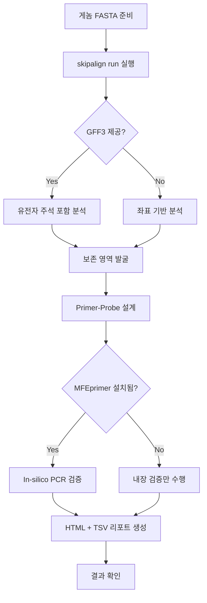

# skipalign 사용자 워크플로우

## 1. 메인 워크플로우



## 2. 단계별 워크플로우

### Step 1: 데이터 준비
- **진입**: 사용자가 분석 대상 바이러스 게놈 FASTA 파일을 한 폴더에 모음
- **행동**: 파일명 = 게놈 식별자 (`DENV1.fasta`, `ZIKV.fasta` 등)
- **선택**: GFF3 주석 파일이 있으면 별도 폴더에 준비 (동일 파일명 stem)

### Step 2: 파이프라인 실행
- **진입**: `skipalign run --input genomes/ --output results/`
- **행동**: 파이프라인이 자동으로 6단계 실행
- **피드백**: Rich progress bar로 각 단계 진행률 표시

### Step 3: 결과 확인
- **진입**: `results/` 폴더 확인
- **산출물**:
  - `report.html` — 브라우저에서 열어 시각적 검토
  - `primers.tsv` — primer 후보 리스트 (기계 파싱용)
  - `conserved_region.fasta` — 발굴된 보존 영역 서열
  - `msa_alignment.fasta` — 보존 영역 MSA 결과
  - `pipeline_summary.json` — 파이프라인 실행 통계

### Step 4: 후속 작업
- Primer 후보를 IDT OligoAnalyzer에서 실험적 검증
- 필요 시 파라미터 변경 후 재실행 (`--k`, `--window`, `--min-genomes`)

## 3. 오류 시나리오

| 오류 | 원인 | 처리 |
|------|------|------|
| FASTA 파일 없음 | 입력 폴더 비어있음 | 에러 메시지 + 예시 명령 출력 |
| MAFFT 미설치 | PATH에 mafft 없음 | 설치 안내 메시지 (conda/apt) |
| 보존 영역 미발견 | k값 부적절 또는 게놈 너무 divergent | 경고 + `skipalign find-k` 안내 |
| Primer 후보 없음 | 보존 영역 내 적합한 binding site 없음 | 경고 + 파라미터 조정 제안 |

## 4. k값 탐색 워크플로우 (고급)

```mermaid
flowchart TD
    A[최적 k를 모를 때] --> B[skipalign find-k 실행]
    B --> C[k=9..51 ACF sweep]
    C --> D[ACF 결과 TSV 출력]
    D --> E[사용자가 최적 k 선택]
    E --> F[skipalign run --k {선택값}]
```
