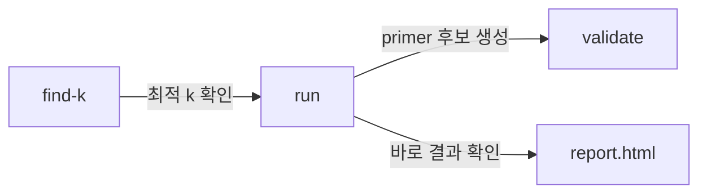

# skipalign CLI 커맨드 목록

> 웹 앱의 "화면 목록" 대신 CLI "커맨드 목록"을 정의합니다.

## 커맨드 1: `skipalign run`
- **ID**: cmd-run
- **역할**: Full pipeline 실행 (메인 진입점)
- **인자**:
  | 옵션 | 단축 | 타입 | 기본값 | 설명 |
  |------|------|------|--------|------|
  | `--input` | `-i` | PATH | (필수) | 게놈 FASTA 디렉토리 |
  | `--annotations` | `-g` | PATH | None | GFF3 디렉토리 (선택) |
  | `--k` | `-k` | INT | 19 | k-mer 길이 |
  | `--min-genomes` | | INT | 3 | 최소 게놈 수 (unitig 필터) |
  | `--window` | `-w` | INT | 300 | 스코어링 윈도우 크기 (bp) |
  | `--design-region` | | INT | 600 | 보존 영역 추출 크기 (bp) |
  | `--output` | `-o` | PATH | results/ | 출력 디렉토리 |
  | `--work-dir` | | PATH | work/ | 중간 산출물 디렉토리 |
  | `--top` | | INT | 5 | 상위 N개 primer 후보 |
  | `--no-report` | | FLAG | false | 리포트 생성 생략 |
- **산출물**: `results/` 디렉토리 (report.html, primers.tsv, ...)
- **의존**: MAFFT 필수, MFEprimer 선택

## 커맨드 2: `skipalign find-k`
- **ID**: cmd-find-k
- **역할**: 최적 k-mer 길이 탐색 (ACF sweep)
- **인자**:
  | 옵션 | 단축 | 타입 | 기본값 | 설명 |
  |------|------|------|--------|------|
  | `--input` | `-i` | PATH | (필수) | 게놈 FASTA 디렉토리 |
  | `--k-min` | | INT | 9 | 탐색 시작 k |
  | `--k-max` | | INT | 51 | 탐색 종료 k |
  | `--step` | | INT | 2 | k 증가 단위 |
  | `--output` | `-o` | PATH | acf_result.tsv | 출력 파일 |
- **산출물**: ACF 결과 TSV (k, acf_score, unique_kmers, shared_kmers)
- **의존**: 없음

## 커맨드 3: `skipalign validate`
- **ID**: cmd-validate
- **역할**: 기존 primer-probe set의 in-silico 검증
- **인자**:
  | 옵션 | 단축 | 타입 | 기본값 | 설명 |
  |------|------|------|--------|------|
  | `--primers` | `-p` | PATH | (필수) | primers.tsv 파일 |
  | `--db` | `-d` | PATH | (필수) | 검증 대상 게놈 FASTA 디렉토리 |
  | `--output` | `-o` | PATH | validation/ | 출력 디렉토리 |
- **산출물**: 검증 결과 TSV + coverage 리포트
- **의존**: MFEprimer (이 커맨드는 필수)

## 커맨드 흐름

## 공통 옵션

| 옵션 | 설명 |
|------|------|
| `--verbose` / `-v` | 상세 로깅 |
| `--quiet` / `-q` | 최소 출력 |
| `--version` | 버전 표시 |
| `--help` | 도움말 |
