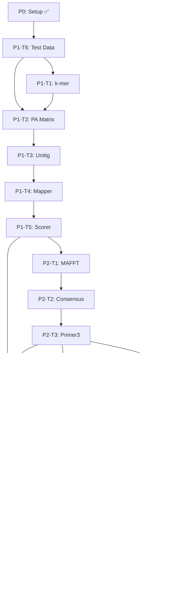

# TASKS.md — skipalign Implementation Plan

> Generated from `docs/planning/01-prd.md` ~ `07-coding-convention.md`
> CLI bioinformatics tool — pipeline module 기반 구조

---

## Phase 0: Project Setup ✅

> 프로젝트 초기 뼈대 (완료)

- [x] P0-T0.1: pyproject.toml, Dockerfile, environment.yml, README.md 생성
- [x] P0-T0.2: src/skipalign/ 패키지 구조 생성 (8개 모듈 스캐폴드)
- [x] P0-T0.3: 기본 테스트 작성 (20개 통과)
- [x] P0-T0.4: GitHub repo 생성 및 초기 push
- [x] P0-T0.5: 기획 문서 7개 작성

---

## Phase 1: Core Pipeline Modules (k-mer → Unitig → Mapping → Scoring)

> 보존 영역 발굴의 핵심 로직. 논문 Stage 3-6에 해당.

### P1-T1: k-mer 모듈 강화 (`kmer.py`)
- [ ] P1-T1.1: `count_kmers_from_fasta()` — FASTA 파일에서 직접 k-mer 추출
- [ ] P1-T1.2: `count_all_genomes()` — 디렉토리 내 전체 게놈 병렬 처리
- [ ] P1-T1.3: ACF (Average Common Feature) 계산 로직 — `find-k` 커맨드 지원
- [ ] P1-T1.4: 테스트 — 실제 바이러스 서열(tests/data/) 대상 k-mer 정확성 검증
- **Done-when**: `pytest tests/test_kmer.py` 통과, tests/data/ 소형 게놈 세트로 end-to-end 검증

### P1-T2: PA Matrix 모듈 강화 (`matrix.py`)
- [ ] P1-T2.1: `build_pa_matrix()` — 대규모 입력 시 메모리 효율성 확인 (sparse)
- [ ] P1-T2.2: `filter_conserved()` — genome_count 기준 필터 + 통계 출력
- [ ] P1-T2.3: 중간 산출물 저장/로드 (`work/pa_matrix.npz`, `work/kmer_index.tsv`)
- [ ] P1-T2.4: 테스트 — 알려진 보존 k-mer가 올바르게 필터링되는지 검증
- **Done-when**: `pytest tests/test_matrix.py` 통과
- **Blocks**: P1-T3

### P1-T3: Unitig 모듈 강화 (`unitig.py`)
- [ ] P1-T3.1: `extract_unitigs()` — 실제 DNA k-mer 대상 정확성 검증
- [ ] P1-T3.2: Unitig에 genome_count 메타데이터 부착
- [ ] P1-T3.3: 고신뢰 unitig 필터 (≥min_genomes)
- [ ] P1-T3.4: 중간 산출물 저장 (`work/unitigs.tsv`)
- [ ] P1-T3.5: 테스트 — 선형/분기 경로에서 unitig 정확성 검증
- **Done-when**: `pytest tests/test_unitig.py` 통과
- **Blocked-by**: P1-T2

### P1-T4: Mapper 모듈 강화 (`mapper.py`)
- [ ] P1-T4.1: `find_exact_matches()` — 성능 최적화 (대량 unitig × 대량 게놈)
- [ ] P1-T4.2: GFF3 파싱 robustness 향상 (누락 필드, 비표준 형식 처리)
- [ ] P1-T4.3: GFF3 없이도 좌표 기반 결과 출력
- [ ] P1-T4.4: 중간 산출물 저장 (`work/hits.tsv`)
- [ ] P1-T4.5: 테스트 — forward/reverse strand 매칭, GFF3 교차 검증
- **Done-when**: `pytest tests/test_mapper.py` 통과
- **Blocked-by**: P1-T3

### P1-T5: Window Scorer 모듈 강화 (`scorer.py`)
- [ ] P1-T5.1: 윈도우 슬라이딩 최적화 (모든 게놈에 대해 독립적으로 scoring)
- [ ] P1-T5.2: 인접 고득점 윈도우 병합 → design_region (600bp) 추출
- [ ] P1-T5.3: 중간 산출물 저장 (`work/windows.tsv`)
- [ ] P1-T5.4: 테스트 — 알려진 NS5 위치가 top window로 나오는지 검증
- **Done-when**: `pytest tests/test_scorer.py` 통과
- **Blocked-by**: P1-T4

### P1-T6: 테스트 데이터 세트 구축
- [ ] P1-T6.1: tests/data/에 소형 테스트 게놈 세트 준비 (8-12개 합성 또는 축약 게놈)
- [ ] P1-T6.2: 대응하는 GFF3 주석 파일 준비 (최소 1개)
- [ ] P1-T6.3: 예상 결과 정의 (어떤 영역이 보존으로 나와야 하는지)
- **Done-when**: `tests/data/` 폴더에 완전한 테스트 세트 존재
- **Blocks**: P1-T1.4, P1-T2.4, P1-T5.4

---

## Phase 2: Primer-Probe Design

> MAFFT MSA + TaqMan 규칙 + primer3 자동 설계. 논문 Stage 7에 해당.

### P2-T1: MAFFT 연동 (`primer.py`)
- [ ] P2-T1.1: 보존 영역 600bp를 각 게놈에서 추출 → multi-FASTA 생성
- [ ] P2-T1.2: `run_mafft()` — subprocess 호출 + 에러 핸들링
- [ ] P2-T1.3: MAFFT 미설치 시 graceful 에러 메시지
- [ ] P2-T1.4: MSA 결과 파싱 (BioPython AlignIO)
- **Done-when**: MAFFT 연동 테스트 통과 (MAFFT 설치 환경에서)
- **Blocked-by**: P1-T5

### P2-T2: Consensus 및 Degeneracy 계산
- [ ] P2-T2.1: MSA에서 position-wise consensus 계산 (≥50% threshold)
- [ ] P2-T2.2: IUPAC ambiguity code 생성 (threshold 미만 위치)
- [ ] P2-T2.3: conservation score per position 계산 (리포트용)
- **Done-when**: 테스트 통과 — 알려진 MSA에서 올바른 consensus 생성
- **Blocked-by**: P2-T1

### P2-T3: Primer3 연동 + TaqMan 규칙
- [ ] P2-T3.1: primer3-py로 후보 primer 자동 생성
- [ ] P2-T3.2: TaqMan 규칙 필터: forward (3' 보존, ≤100 degeneracy, no GGGG)
- [ ] P2-T3.3: TaqMan 규칙 필터: probe (no 5'G, no GGGG, no AAAAAA, Tm > primer)
- [ ] P2-T3.4: TaqMan 규칙 필터: reverse (≤100 degeneracy)
- [ ] P2-T3.5: `PrimerProbeSet` dataclass에 Tm, GC%, ΔG 계산 결과 포함
- [ ] P2-T3.6: 상위 N개 후보 랭킹 및 출력
- **Done-when**: `pytest tests/test_primer.py` 통과 (기존 + 신규 테스트)
- **Blocked-by**: P2-T2

---

## Phase 3: Validation

> MFEprimer in-silico PCR 검증 (선택적 기능)

### P3-T1: MFEprimer 연동 (`validator.py` 신규)
- [ ] P3-T1.1: `validator.py` 모듈 생성
- [ ] P3-T1.2: MFEprimer CLI 래핑 (subprocess)
- [ ] P3-T1.3: MFEprimer 미설치 시 skip + 경고 메시지
- [ ] P3-T1.4: 결과 파싱 → specificity hits, cross-reactivity 판정
- [ ] P3-T1.5: 테스트 — MFEprimer mock 또는 설치 환경에서 검증
- **Done-when**: `pytest tests/test_validator.py` 통과
- **Blocked-by**: P2-T3

### P3-T2: `skipalign validate` 커맨드 구현
- [ ] P3-T2.1: CLI에 `validate` 서브커맨드 추가
- [ ] P3-T2.2: `--primers`, `--db`, `--output` 인자 처리
- [ ] P3-T2.3: 독립 실행 가능 (기존 primers.tsv 입력)
- **Done-when**: `skipalign validate --help` 동작
- **Blocked-by**: P3-T1

---

## Phase 4: Report Generation

> HTML + TSV 결과 리포트

### P4-T1: TSV 출력 (`reporter.py` 신규)
- [ ] P4-T1.1: `reporter.py` 모듈 생성
- [ ] P4-T1.2: `primers.tsv` 생성 (sequence, Tm, GC%, degeneracy, issues)
- [ ] P4-T1.3: `conserved_region.fasta` 생성
- [ ] P4-T1.4: `pipeline_summary.json` 생성
- **Done-when**: 올바른 TSV/JSON 파일 생성 확인
- **Blocked-by**: P2-T3

### P4-T2: HTML 리포트
- [ ] P4-T2.1: Jinja2 템플릿 구조 설계 (`templates/report.html`)
- [ ] P4-T2.2: 섹션 1 — Pipeline Summary 테이블
- [ ] P4-T2.3: 섹션 2 — Conservation Landscape 시각화 (matplotlib → base64 embed)
- [ ] P4-T2.4: 섹션 3 — MSA Conservation Heatmap
- [ ] P4-T2.5: 섹션 4 — Primer-Probe Candidates 테이블
- [ ] P4-T2.6: 섹션 5 — Validation Results (MFEprimer, 있을 경우)
- [ ] P4-T2.7: self-contained HTML (CSS/JS 인라인, 외부 의존성 없음)
- **Done-when**: 브라우저에서 report.html이 올바르게 렌더링
- **Blocked-by**: P4-T1, P3-T1

---

## Phase 5: Pipeline Orchestration

> 모든 모듈을 연결하는 `pipeline.py` + CLI `run` 커맨드 완성

### P5-T1: Pipeline Orchestrator (`pipeline.py` 신규)
- [ ] P5-T1.1: `pipeline.py` 모듈 생성
- [ ] P5-T1.2: 6단계 파이프라인 함수 체이닝 (kmer → matrix → unitig → mapper → scorer → primer)
- [ ] P5-T1.3: work directory 관리 (중간 산출물 저장/캐시)
- [ ] P5-T1.4: Rich progress bar 통합 (단계별 진행률)
- [ ] P5-T1.5: 에러 복구 (중간 단계 실패 시 재시작 지원)
- **Done-when**: `skipalign run -i tests/data/ -o /tmp/test_results/` end-to-end 동작
- **Blocked-by**: P1-T5, P2-T3, P4-T2

### P5-T2: CLI 완성 (`cli.py`)
- [ ] P5-T2.1: `run` 커맨드 — pipeline.py 연결, 모든 옵션 처리
- [ ] P5-T2.2: `find-k` 커맨드 — ACF sweep 연결
- [ ] P5-T2.3: `--verbose`, `--quiet` 로깅 레벨 처리
- [ ] P5-T2.4: MAFFT/MFEprimer 런타임 체크 + 안내 메시지
- **Done-when**: `skipalign run --help`, `skipalign find-k --help` 동작 + end-to-end 테스트 통과
- **Blocked-by**: P5-T1, P3-T2

---

## Phase 6: Integration Test & CI/CD

### P6-T1: Integration Test
- [ ] P6-T1.1: tests/data/ 소형 게놈 세트로 full pipeline end-to-end 테스트
- [ ] P6-T1.2: 출력 파일 존재 및 형식 검증 (primers.tsv, report.html, summary.json)
- [ ] P6-T1.3: 논문 재현 테스트 (선택적 — 실제 Orthoflavivirus 51개 게놈)
- **Done-when**: `pytest tests/test_pipeline.py` 통과
- **Blocked-by**: P5-T2

### P6-T2: CI/CD (GitHub Actions)
- [ ] P6-T2.1: `.github/workflows/ci.yml` 생성 (lint + test matrix)
- [ ] P6-T2.2: Python 3.10/3.11/3.12 매트릭스 테스트
- [ ] P6-T2.3: Docker 빌드 테스트
- [ ] P6-T2.4: MAFFT 설치 포함 통합 테스트 job
- **Done-when**: GitHub Actions green
- **Blocked-by**: P6-T1

### P6-T3: 배포 준비
- [ ] P6-T3.1: Dockerfile 최종 검증 (MAFFT + MFEprimer 포함)
- [ ] P6-T3.2: environment.yml 최종 검증
- [ ] P6-T3.3: README.md 업데이트 (최종 사용 예시, 출력 설명)
- [ ] P6-T3.4: CLAUDE.md 업데이트 (빌드/테스트 커맨드 추가)
- **Done-when**: 3-tier 배포 (pip/conda/docker) 모두 동작 확인
- **Blocked-by**: P6-T2

---

## Dependency Graph

---

## Summary

| Phase | 태스크 수 | 상태 |
|-------|----------|------|
| P0: Setup | 5 | ✅ 완료 |
| P1: Core Pipeline | 6 | ⬜ 대기 |
| P2: Primer Design | 3 | ⬜ 대기 |
| P3: Validation | 2 | ⬜ 대기 |
| P4: Report | 2 | ⬜ 대기 |
| P5: Orchestration | 2 | ⬜ 대기 |
| P6: CI/CD & Release | 3 | ⬜ 대기 |
| **Total** | **23** | |
